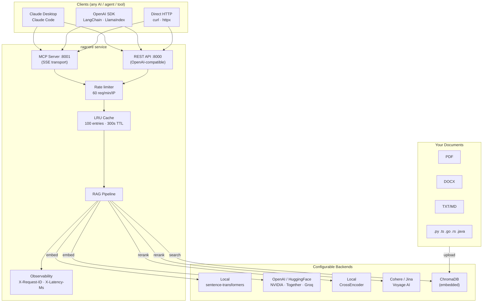
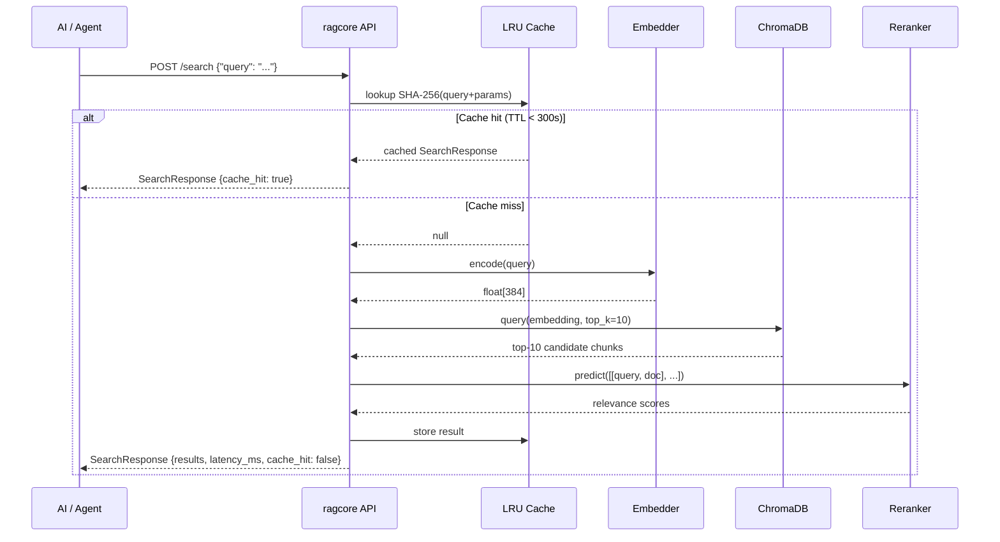
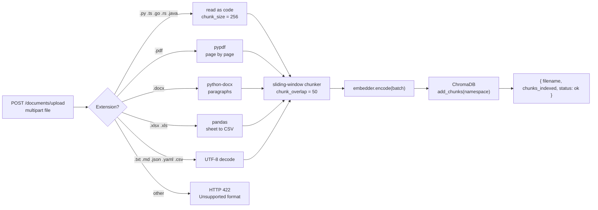
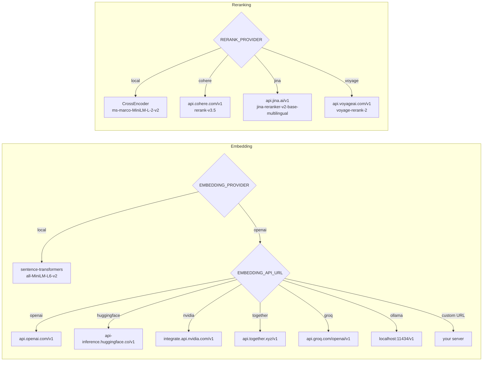

<div align="center">

# ragcore

**Pure RAG-as-a-service.**
ragcore retrieves relevant document chunks and returns them to any AI.
It does **not** generate text, call any LLM, or make AI decisions.

[](tests/)
[](pyproject.toml)
[](ragcore/server/rest.py)
[](ragcore/server/mcp.py)
[](LICENSE)

</div>

---

## What it does

```
Any AI / Agent ──── "Find context about X" ────► ragcore ──► ranked chunks + metadata
                                                  embed → search → rerank
                                                  (your documents, your infra)
```

Any AI that needs grounded context queries ragcore. ragcore returns the best matching chunks from your documents. **The AI decides what to do with them.**

---

## Architecture



---

## RAG Pipeline



---

## Document Ingestion



---

## Provider Selection



---

## Quick Start

### Docker (recommended)

```bash
git clone https://github.com/EfrainGaray/ragcore && cd ragcore
cp .env.example .env
docker compose up --build
```

- REST API → `http://localhost:8000`
- MCP SSE  → `http://localhost:8001/sse`
- Swagger  → `http://localhost:8000/docs`

### Local (no Docker)

```bash
python -m venv .venv && source .venv/bin/activate
pip install -e ".[dev]"
python -m ragcore.main
```

### Ingest your first document

```bash
curl -X POST http://localhost:8000/documents/upload \
  -F "file=@docs/manual.pdf"
# {"filename": "manual.pdf", "chunks_indexed": 47, "status": "ok"}
```

### Search

```bash
curl -X POST http://localhost:8000/search \
  -H "Content-Type: application/json" \
  -d '{"query": "how to configure authentication", "top_n": 3}'
```

---

## Integration Guides

### Claude Desktop / Claude Code (MCP)

```json
// ~/Library/Application Support/Claude/claude_desktop_config.json
{
  "mcpServers": {
    "ragcore": {
      "url": "http://localhost:8001/sse"
    }
  }
}
```

```bash
# Claude Code CLI
claude mcp add ragcore --transport sse http://localhost:8001/sse
```

Claude will see three tools: `search_knowledge_base`, `list_documents`, `get_document_count`.

### Any OpenAI SDK

```python
from openai import OpenAI
import json

client = OpenAI(base_url="http://localhost:8000", api_key="not-needed")

response = client.chat.completions.create(
    model="ragcore",
    messages=[{"role": "user", "content": "how to configure authentication?"}],
)

# ragcore returns chunks as JSON — NOT an LLM answer
chunks = json.loads(response.choices[0].message.content)
print(chunks["results"][0]["content"])
```

### LangChain

```python
from langchain.schema import BaseRetriever, Document
import httpx

class RagcoreRetriever(BaseRetriever):
    def get_relevant_documents(self, query: str):
        r = httpx.post(
            "http://localhost:8000/search",
            json={"query": query, "top_n": 5},
        )
        return [
            Document(
                page_content=c["content"],
                metadata={"filename": c["filename"], "score": c["score"]},
            )
            for c in r.json()["results"]
        ]
```

### Continue.dev

```json
{
  "contextProviders": [{
    "name": "http",
    "params": {
      "url": "http://localhost:8000/search",
      "title": "ragcore",
      "description": "Local knowledge base"
    }
  }]
}
```

### Cursor / Windsurf (MCP)

```json
{
  "ragcore": { "url": "http://localhost:8001/sse", "transport": "sse" }
}
```

---

## API Reference

### Native RAG

| Method | Path | Description |
|--------|------|-------------|
| `POST` | `/search` | Embed → search → rerank → return chunks |
| `POST` | `/documents/upload` | Chunk, embed, and store a file |
| `GET` | `/documents` | List all indexed documents |
| `DELETE` | `/documents/{filename}` | Remove all chunks for a file |
| `GET` | `/namespaces` | List all namespaces in the collection |
| `GET` | `/health` | Liveness + readiness probe |

**SearchRequest**
```json
{
  "query": "string (required, max 2000 chars)",
  "top_n": 5,
  "filters": {"filename": "manual.pdf"}
}
```

**SearchResponse**
```json
{
  "results": [
    {
      "id": "default:abc123",
      "content": "...",
      "score": 0.92,
      "filename": "manual.pdf",
      "page": 3,
      "chunk_index": 12,
      "metadata": {}
    }
  ],
  "total": 3,
  "query": "...",
  "latency_ms": 38.5,
  "cache_hit": false
}
```

### OpenAI-Compatible

| Method | Path | Description |
|--------|------|-------------|
| `GET` | `/v1/models` | Returns `[{id: "ragcore", …}]` |
| `POST` | `/v1/embeddings` | Standard OpenAI embeddings format |
| `POST` | `/v1/chat/completions` | Last user message → RAG → chunks as JSON in `content` |

### MCP Tools (port 8001)

| Tool | Arguments | Returns |
|------|-----------|---------|
| `search_knowledge_base` | `query: str, top_n?: int` | Ranked chunks list |
| `list_documents` | — | Documents with chunk counts |
| `get_document_count` | — | `{total_chunks, total_documents}` |

---

## Configuration

### Core

| Variable | Default | Description |
|----------|---------|-------------|
| `CHROMA_PATH` | `./data/chroma` | ChromaDB persistence directory |
| `CHROMA_COLLECTION` | `ragcore` | Collection name |
| `CHROMA_NAMESPACE` | `default` | Namespace for multi-tenant isolation |
| `TOP_K` | `10` | Vector search candidates |
| `TOP_N` | `5` | Final results after reranking |
| `CHUNK_SIZE` | `512` | Characters per chunk (prose/docs) |
| `CHUNK_OVERLAP` | `50` | Overlap between adjacent chunks |
| `HOST` | `0.0.0.0` | Bind address |
| `PORT` | `8000` | REST API port |
| `MCP_PORT` | `8001` | MCP SSE server port |

### Embedding

| Variable | Default | Description |
|----------|---------|-------------|
| `EMBEDDING_PROVIDER` | `local` | `local` or `openai` |
| `EMBEDDING_MODEL` | `all-MiniLM-L6-v2` | Model name |
| `EMBEDDING_API_URL` | — | Alias or full base URL |
| `EMBEDDING_API_KEY` | — | API key |

**Aliases:** `openai` · `huggingface` · `nvidia` · `together` · `groq` · `ollama`

### Reranker

| Variable | Default | Description |
|----------|---------|-------------|
| `RERANK_PROVIDER` | `local` | `local`, `cohere`, `jina`, or `voyage` |
| `RERANK_MODEL` | `cross-encoder/ms-marco-MiniLM-L-2-v2` | Model name |
| `RERANK_API_URL` | — | Alias or full base URL |
| `RERANK_API_KEY` | — | API key |

**Aliases:** `cohere` (1K reranks/month free) · `jina` (free tier) · `voyage` (free credits)

---

## Example `.env` Configurations

**Fully local — zero API keys (default)**
```env
EMBEDDING_PROVIDER=local
RERANK_PROVIDER=local
```

**HuggingFace embedding + Cohere reranking**
```env
EMBEDDING_PROVIDER=openai
EMBEDDING_API_URL=huggingface
EMBEDDING_API_KEY=hf_xxxxxxxxxxxx
EMBEDDING_MODEL=sentence-transformers/all-MiniLM-L6-v2

RERANK_PROVIDER=cohere
RERANK_API_KEY=your-cohere-key
```

**OpenAI embedding + Jina reranking**
```env
EMBEDDING_PROVIDER=openai
EMBEDDING_API_URL=openai
EMBEDDING_API_KEY=sk-xxxxxxxxxxxx
EMBEDDING_MODEL=text-embedding-3-small

RERANK_PROVIDER=jina
RERANK_API_KEY=jina_xxxxxxxxxxxx
```

**Ollama (local GPU)**
```env
EMBEDDING_PROVIDER=openai
EMBEDDING_API_URL=ollama
EMBEDDING_API_KEY=none
EMBEDDING_MODEL=nomic-embed-text

RERANK_PROVIDER=local
```

---

## Development

```bash
pip install -e ".[dev]"

# Run all tests (zero ML downloads, ~2.5s)
pytest tests/ -v

# Single file
pytest tests/test_retrieval.py -v
```

**75 tests** — embedding, reranking, ingestion, REST API, MCP, config, retrieval. All run with in-memory fakes; no model downloads required.

---

## Project Structure

```
ragcore/
├── ragcore/
│   ├── config.py          # pydantic-settings — all env vars
│   ├── models.py          # SearchRequest/Response, DocumentInfo, ChatCompletion*
│   ├── retrieval.py       # Retriever: embed → search → rerank → cache
│   ├── embedding.py       # LocalEmbedder + OpenAICompatibleEmbedder + factory
│   ├── reranker.py        # LocalReranker + RemoteReranker + factory
│   ├── main.py            # Entry point — spawns REST + MCP processes
│   ├── server/
│   │   ├── rest.py        # FastAPI app factory (OpenAPI tags, response schemas)
│   │   ├── mcp.py         # FastMCP SSE server
│   │   └── middleware.py  # RateLimitMiddleware + ObservabilityMiddleware
│   └── store/
│       ├── chroma.py      # RagStore — namespace-scoped ChromaDB wrapper
│       ├── ingest.py      # File readers + chunker + Ingestor
│       └── cache.py       # SearchCache — LRU + SHA-256 key + TTL
└── tests/
    ├── conftest.py         # In-memory fakes (chromadb + sentence-transformers)
    ├── test_embedding.py   # 9 tests
    ├── test_reranker.py    # 14 tests
    ├── test_retrieval.py   # 8 tests
    ├── test_rest.py        # 19 tests
    ├── test_mcp.py         # 7 tests
    ├── test_ingest.py      # 11 tests
    └── test_config.py      # 6 tests (75 total)
```

---

## Supported File Formats

| Type | Extensions |
|------|-----------|
| Documents | `.pdf` `.docx` `.txt` `.md` |
| Spreadsheets | `.xlsx` `.xls` |
| Config / data | `.json` `.yaml` `.yml` `.toml` `.csv` |
| Source code | `.py` `.ts` `.js` `.go` `.rs` `.java` |

Code files use a smaller chunk size (256 chars) to preserve function and class boundaries, and are tagged `file_type: code` in metadata.
