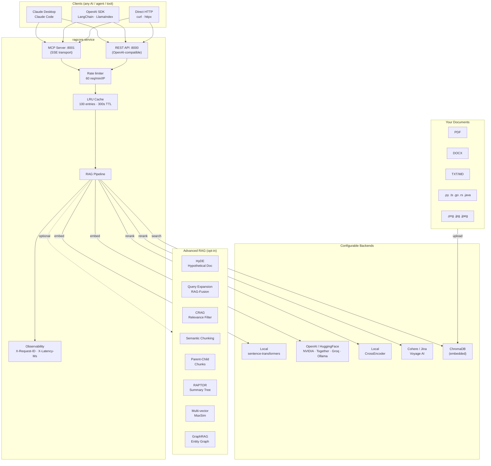
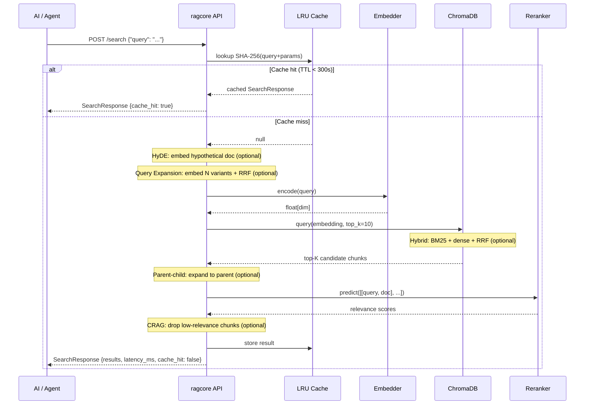
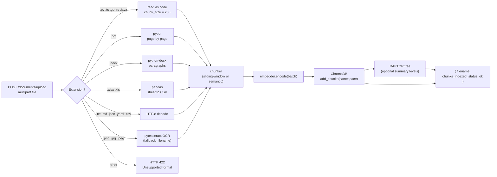
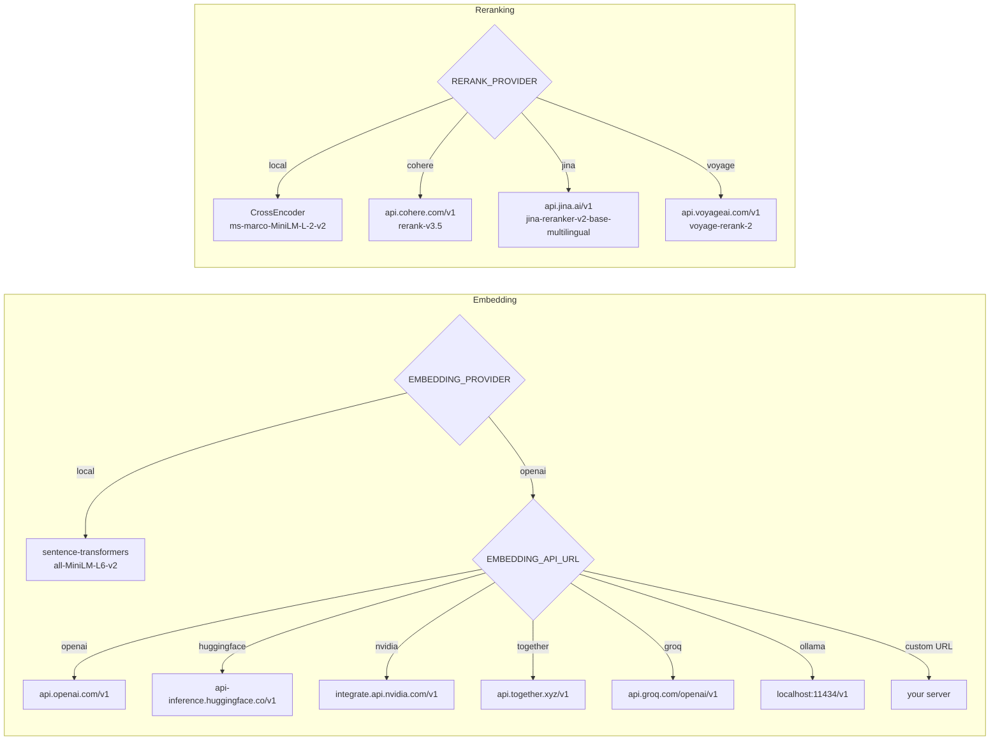

<div align="center">

# ragcore

**Pure RAG-as-a-service.**
ragcore retrieves relevant document chunks and returns them to any AI.
It does **not** generate text, call any LLM, or make AI decisions.

[](tests/)
[](pyproject.toml)
[](ragcore/server/rest.py)
[](ragcore/server/mcp.py)
[](LICENSE)

</div>

---

## What it does

```
Any AI / Agent ──── "Find context about X" ────► ragcore ──► ranked chunks + metadata
                                                  embed → search → rerank
                                                  (your documents, your infra)
```

Any AI that needs grounded context queries ragcore. ragcore returns the best matching chunks from your documents. **The AI decides what to do with them.**

---

## Feature Matrix

All features are **off by default**. Enable only what you need via `.env`.

### Retrieval Techniques

| Feature | Env Flag | Description | Status |
|---------|----------|-------------|--------|
| Dense vector search | always on | Cosine similarity via ChromaDB + HNSW | ✅ Core |
| **Hybrid search** | `HYBRID_SEARCH=true` | BM25 keyword + dense vector, fused with RRF (k=60) | ✅ |
| **HyDE** | `HYDE_ENABLED=true` | Embed LLM-generated hypothetical answer instead of raw query | ✅ |
| **Query expansion** | `QUERY_EXPANSION_ENABLED=true` | Generate N query variants (RAG-Fusion), fuse with RRF | ✅ |
| **CRAG** | `CRAG_ENABLED=true` | Drop retrieved chunks below cross-encoder relevance threshold | ✅ |
| **Multi-vector (MaxSim)** | `MULTIVECTOR_ENABLED=true` | ColBERT-style late interaction — one embedding per sentence | ✅ |
| **GraphRAG** | `GRAPHRAG_ENABLED=true` | Entity graph over docs, graph-traversal-guided retrieval | ✅ |
| Cache | always on | LRU cache, SHA-256 key, 100 entries, 300s TTL | ✅ Core |

### Chunking Strategies

| Feature | Env Flag | Description | Status |
|---------|----------|-------------|--------|
| Sliding-window chunker | always on | Character-level with word-boundary snapping | ✅ Core |
| **Semantic chunking** | `SEMANTIC_CHUNKING=true` | Split at cosine-similarity drops between sentence embeddings | ✅ |
| **Parent-child chunks** | `PARENT_CHILD_CHUNKS=true` | Index small children (512), return large parent context (1536) at query time | ✅ |
| **RAPTOR** | `RAPTOR_ENABLED=true` | Recursive LLM summarization tree — summary chunks indexed at each level | ✅ |
| Code-aware chunking | auto | Smaller chunks (256) + `file_type: code` tag for `.py/.ts/.go/.rs/.java` | ✅ Core |

### Ingestion

| Feature | Description | Status |
|---------|-------------|--------|
| PDF | Page-by-page text extraction via pypdf | ✅ |
| DOCX | Paragraph extraction via python-docx | ✅ |
| XLSX / XLS | Sheet-to-CSV via pandas | ✅ |
| TXT / MD / JSON / YAML / TOML / CSV | UTF-8 decode | ✅ |
| Source code (.py .ts .js .go .rs .java) | Plain text, smaller chunks | ✅ |
| **Images (.png .jpg .jpeg)** | OCR via pytesseract (falls back to filename placeholder) | ✅ |

### Embedding Providers

| Provider | `EMBEDDING_API_URL` | Notes |
|----------|---------------------|-------|
| **Local** (default) | — | `sentence-transformers/all-MiniLM-L6-v2`, no API key |
| OpenAI | `openai` | `text-embedding-3-small` etc. |
| HuggingFace Inference API | `huggingface` | Free tier available |
| NVIDIA NIM | `nvidia` | |
| Together AI | `together` | |
| Groq | `groq` | |
| Ollama | `ollama` | Fully local, GPU-accelerated |
| Custom | any base URL | Any `/v1/embeddings`-compatible server |

### Reranker Providers

| Provider | `RERANK_PROVIDER` | Default Model | Notes |
|----------|-------------------|---------------|-------|
| **Local** (default) | `local` | `cross-encoder/ms-marco-MiniLM-L-2-v2` | No API key |
| Cohere | `cohere` | `rerank-v3.5` | 1K reranks/month free |
| Jina AI | `jina` | `jina-reranker-v2-base-multilingual` | Free tier |
| Voyage AI | `voyage` | `voyage-rerank-2` | Free credits |
| Custom | any base URL | — | Any `/v1/rerank`-compatible server |

### Infrastructure

| Feature | Description | Status |
|---------|-------------|--------|
| OpenAI-compatible REST API | `/v1/models`, `/v1/embeddings`, `/v1/chat/completions` | ✅ |
| **Streaming SSE** | `/v1/chat/completions` with `stream: true` | ✅ |
| MCP server (SSE transport) | Claude Desktop / Claude Code integration | ✅ |
| Multi-tenant namespaces | Scoped isolation per namespace | ✅ |
| Rate limiting | 60 req/min/IP, configurable | ✅ |
| Observability | `X-Request-ID`, `X-Latency-Ms` headers + structured logs | ✅ |
| **RAG evaluation** | `/evaluate` endpoint — faithfulness, relevance, precision, recall (RAGAS-inspired) | ✅ |
| **Graph search** | `/graph/search` endpoint — entity-guided retrieval | ✅ |

---

## Architecture



---

## RAG Pipeline



---

## Document Ingestion



---

## Provider Selection



---

## Quick Start

### Docker (recommended)

```bash
git clone https://github.com/EfrainGaray/ragcore && cd ragcore
cp .env.example .env
docker compose up --build
```

- REST API → `http://localhost:8000`
- MCP SSE  → `http://localhost:8001/sse`
- Swagger  → `http://localhost:8000/docs`

### Local (no Docker)

```bash
python -m venv .venv && source .venv/bin/activate
pip install -e ".[dev]"
python -m ragcore.main
```

### Ingest your first document

```bash
curl -X POST http://localhost:8000/documents/upload \
  -F "file=@docs/manual.pdf"
# {"filename": "manual.pdf", "chunks_indexed": 47, "status": "ok"}
```

### Search

```bash
curl -X POST http://localhost:8000/search \
  -H "Content-Type: application/json" \
  -d '{"query": "how to configure authentication", "top_n": 3}'
```

### Streaming

```bash
curl -X POST http://localhost:8000/v1/chat/completions \
  -H "Content-Type: application/json" \
  -d '{"model": "ragcore", "stream": true, "messages": [{"role": "user", "content": "what is RAG?"}]}'
```

### Evaluate a RAG response

```bash
curl -X POST http://localhost:8000/evaluate \
  -H "Content-Type: application/json" \
  -d '{
    "query": "what is RAG?",
    "answer": "RAG stands for Retrieval-Augmented Generation.",
    "contexts": ["RAG combines retrieval with language models."],
    "ground_truth": "RAG is a technique that enhances LLMs with external knowledge."
  }'
# {"faithfulness": 0.82, "answer_relevance": 0.91, "context_precision": 0.87, "context_recall": 0.76}
```

---

## Integration Guides

### Claude Desktop / Claude Code (MCP)

```json
// ~/Library/Application Support/Claude/claude_desktop_config.json
{
  "mcpServers": {
    "ragcore": {
      "url": "http://localhost:8001/sse"
    }
  }
}
```

```bash
# Claude Code CLI
claude mcp add ragcore --transport sse http://localhost:8001/sse
```

Claude will see three tools: `search_knowledge_base`, `list_documents`, `get_document_count`.

### Any OpenAI SDK

```python
from openai import OpenAI
import json

client = OpenAI(base_url="http://localhost:8000", api_key="not-needed")

response = client.chat.completions.create(
    model="ragcore",
    messages=[{"role": "user", "content": "how to configure authentication?"}],
)

# ragcore returns chunks as JSON — NOT an LLM answer
chunks = json.loads(response.choices[0].message.content)
print(chunks["results"][0]["content"])
```

### LangChain

```python
from langchain.schema import BaseRetriever, Document
import httpx

class RagcoreRetriever(BaseRetriever):
    def get_relevant_documents(self, query: str):
        r = httpx.post(
            "http://localhost:8000/search",
            json={"query": query, "top_n": 5},
        )
        return [
            Document(
                page_content=c["content"],
                metadata={"filename": c["filename"], "score": c["score"]},
            )
            for c in r.json()["results"]
        ]
```

### Continue.dev

```json
{
  "contextProviders": [{
    "name": "http",
    "params": {
      "url": "http://localhost:8000/search",
      "title": "ragcore",
      "description": "Local knowledge base"
    }
  }]
}
```

### Cursor / Windsurf (MCP)

```json
{
  "ragcore": { "url": "http://localhost:8001/sse", "transport": "sse" }
}
```

---

## API Reference

### Native RAG

| Method | Path | Description |
|--------|------|-------------|
| `POST` | `/search` | Embed → search → rerank → return chunks |
| `POST` | `/documents/upload` | Chunk, embed, and store a file |
| `GET` | `/documents` | List all indexed documents |
| `DELETE` | `/documents/{filename}` | Remove all chunks for a file |
| `GET` | `/namespaces` | List all namespaces in the collection |
| `GET` | `/health` | Liveness + readiness probe |
| `POST` | `/evaluate` | Score a RAG response (faithfulness, relevance, precision, recall) |
| `POST` | `/graph/search` | Graph-guided retrieval by entity traversal |

**SearchRequest**
```json
{
  "query": "string (required, max 2000 chars)",
  "top_n": 5,
  "filters": {"filename": "manual.pdf"}
}
```

**SearchResponse**
```json
{
  "results": [
    {
      "id": "default:abc123",
      "content": "...",
      "score": 0.92,
      "filename": "manual.pdf",
      "page": 3,
      "chunk_index": 12,
      "metadata": {}
    }
  ],
  "total": 3,
  "query": "...",
  "latency_ms": 38.5,
  "cache_hit": false
}
```

**EvalRequest / EvalResult**
```json
// POST /evaluate
{ "query": "...", "answer": "...", "contexts": ["..."], "ground_truth": "..." }

// Response
{ "faithfulness": 0.82, "answer_relevance": 0.91, "context_precision": 0.87, "context_recall": 0.76 }
```

### OpenAI-Compatible

| Method | Path | Description |
|--------|------|-------------|
| `GET` | `/v1/models` | Returns `[{id: "ragcore", …}]` |
| `POST` | `/v1/embeddings` | Standard OpenAI embeddings format |
| `POST` | `/v1/chat/completions` | Last user message → RAG → chunks as JSON in `content` |
| `POST` | `/v1/chat/completions` (stream) | Same with `"stream": true` → SSE event stream |

### MCP Tools (port 8001)

| Tool | Arguments | Returns |
|------|-----------|---------|
| `search_knowledge_base` | `query: str, top_n?: int` | Ranked chunks list |
| `list_documents` | — | Documents with chunk counts |
| `get_document_count` | — | `{total_chunks, total_documents}` |

---

## Configuration

### Core

| Variable | Default | Description |
|----------|---------|-------------|
| `CHROMA_PATH` | `./data/chroma` | ChromaDB persistence directory |
| `CHROMA_COLLECTION` | `ragcore` | Collection name |
| `CHROMA_NAMESPACE` | `default` | Namespace for multi-tenant isolation |
| `TOP_K` | `10` | Vector search candidates |
| `TOP_N` | `5` | Final results after reranking |
| `CHUNK_SIZE` | `512` | Characters per chunk (prose/docs) |
| `CHUNK_OVERLAP` | `50` | Overlap between adjacent chunks |
| `HOST` | `0.0.0.0` | Bind address |
| `PORT` | `8000` | REST API port |
| `MCP_PORT` | `8001` | MCP SSE server port |

### Embedding

| Variable | Default | Description |
|----------|---------|-------------|
| `EMBEDDING_PROVIDER` | `local` | `local` or `openai` |
| `EMBEDDING_MODEL` | `all-MiniLM-L6-v2` | Model name |
| `EMBEDDING_API_URL` | — | Alias or full base URL |
| `EMBEDDING_API_KEY` | — | API key |

**Aliases:** `openai` · `huggingface` · `nvidia` · `together` · `groq` · `ollama`

### Reranker

| Variable | Default | Description |
|----------|---------|-------------|
| `RERANK_PROVIDER` | `local` | `local`, `cohere`, `jina`, or `voyage` |
| `RERANK_MODEL` | `cross-encoder/ms-marco-MiniLM-L-2-v2` | Model name |
| `RERANK_API_URL` | — | Alias or full base URL |
| `RERANK_API_KEY` | — | API key |

**Aliases:** `cohere` (1K reranks/month free) · `jina` (free tier) · `voyage` (free credits)

### Hybrid Search

| Variable | Default | Description |
|----------|---------|-------------|
| `HYBRID_SEARCH` | `false` | Enable BM25 + dense + RRF fusion |

### Chunking

| Variable | Default | Description |
|----------|---------|-------------|
| `SEMANTIC_CHUNKING` | `false` | Split by embedding similarity instead of character count |
| `SEMANTIC_CHUNK_THRESHOLD` | `0.5` | Cosine similarity below which a new chunk starts |
| `SEMANTIC_CHUNK_MAX_SIZE` | `512` | Max characters per semantic chunk |
| `PARENT_CHILD_CHUNKS` | `false` | Index small children, return large parent at query time |
| `PARENT_CHUNK_SIZE` | `1536` | Characters per parent chunk |

### HyDE

| Variable | Default | Description |
|----------|---------|-------------|
| `HYDE_ENABLED` | `false` | Embed LLM-generated hypothetical answer |
| `HYDE_LLM_URL` | — | LLM base URL (alias or full) |
| `HYDE_LLM_KEY` | — | LLM API key |
| `HYDE_LLM_MODEL` | `gpt-4o-mini` | LLM model name |

### Query Expansion

| Variable | Default | Description |
|----------|---------|-------------|
| `QUERY_EXPANSION_ENABLED` | `false` | Generate N query variants and fuse with RRF |
| `QUERY_EXPANSION_COUNT` | `3` | Number of alternative phrasings |

> HyDE and Query Expansion share the same `HYDE_LLM_*` settings.

### CRAG

| Variable | Default | Description |
|----------|---------|-------------|
| `CRAG_ENABLED` | `false` | Filter chunks below relevance threshold |
| `CRAG_THRESHOLD` | `0.5` | Cross-encoder score below which chunks are dropped |
| `CRAG_WEB_SEARCH` | `false` | Supplement with web search when all chunks filtered |

### RAPTOR

| Variable | Default | Description |
|----------|---------|-------------|
| `RAPTOR_ENABLED` | `false` | Build recursive summary tree at ingest time |
| `RAPTOR_LEVELS` | `3` | Number of summary levels |
| `RAPTOR_LLM_URL` | — | LLM URL (falls back to `HYDE_LLM_URL`) |
| `RAPTOR_LLM_KEY` | — | LLM API key |
| `RAPTOR_LLM_MODEL` | `gpt-4o-mini` | LLM model name |

### GraphRAG

| Variable | Default | Description |
|----------|---------|-------------|
| `GRAPHRAG_ENABLED` | `false` | Build entity graph at ingest, expose `/graph/search` |
| `GRAPHRAG_SPACY_MODEL` | `en_core_web_sm` | spaCy model for NER |

### RAG Evaluation

| Variable | Default | Description |
|----------|---------|-------------|
| `EVAL_ENABLED` | `false` | Enable `/evaluate` endpoint |
| `EVAL_LLM_URL` | — | LLM for faithfulness scoring (falls back to heuristic) |
| `EVAL_LLM_KEY` | — |  |
| `EVAL_LLM_MODEL` | `gpt-4o-mini` |  |

---

## Example `.env` Configurations

**Fully local — zero API keys (default)**
```env
EMBEDDING_PROVIDER=local
RERANK_PROVIDER=local
```

**Full advanced RAG stack (local models + OpenAI for LLM features)**
```env
EMBEDDING_PROVIDER=local
RERANK_PROVIDER=local

HYBRID_SEARCH=true
PARENT_CHILD_CHUNKS=true
SEMANTIC_CHUNKING=true

HYDE_ENABLED=true
HYDE_LLM_URL=openai
HYDE_LLM_KEY=sk-xxxxxxxxxxxx
HYDE_LLM_MODEL=gpt-4o-mini

QUERY_EXPANSION_ENABLED=true
QUERY_EXPANSION_COUNT=3

CRAG_ENABLED=true
CRAG_THRESHOLD=0.3

RAPTOR_ENABLED=true
RAPTOR_LEVELS=2

EVAL_ENABLED=true
```

**HuggingFace embedding + Cohere reranking**
```env
EMBEDDING_PROVIDER=openai
EMBEDDING_API_URL=huggingface
EMBEDDING_API_KEY=hf_xxxxxxxxxxxx
EMBEDDING_MODEL=sentence-transformers/all-MiniLM-L6-v2

RERANK_PROVIDER=cohere
RERANK_API_KEY=your-cohere-key
```

**Ollama (local GPU)**
```env
EMBEDDING_PROVIDER=openai
EMBEDDING_API_URL=ollama
EMBEDDING_API_KEY=none
EMBEDDING_MODEL=nomic-embed-text

RERANK_PROVIDER=local
```

---

## Development

```bash
pip install -e ".[dev]"

# Run all tests (zero ML downloads, ~3s)
pytest tests/ -v

# Single feature
pytest tests/test_retrieval.py -v
```

**142 tests** covering embedding, reranking, ingestion, REST API, MCP, config, retrieval, hybrid search, HyDE, query expansion, chunk hierarchy, semantic chunking, CRAG, RAPTOR, RAG evaluation, multi-vector, GraphRAG, multi-modal, streaming SSE. All run with in-memory fakes — no model downloads required.

---

## Project Structure

```
ragcore/
├── ragcore/
│   ├── config.py              # pydantic-settings — all env vars
│   ├── models.py              # SearchRequest/Response, DocumentInfo, ChatCompletion*
│   ├── retrieval.py           # Retriever: embed → search → rerank → cache
│   ├── embedding.py           # LocalEmbedder + OpenAICompatibleEmbedder + factory
│   ├── reranker.py            # LocalReranker + RemoteReranker + factory
│   ├── hyde.py                # HyDE: hypothetical document embedding
│   ├── query_expansion.py     # QueryExpander: RAG-Fusion variant generation
│   ├── crag.py                # CorrectiveRAG: cross-encoder relevance filtering
│   ├── raptor.py              # RaptorIndexer: recursive LLM summary tree
│   ├── evaluation.py          # RAGEvaluator: RAGAS-inspired metrics
│   ├── multivector.py         # MultiVectorRetriever: MaxSim late interaction
│   ├── multimodal.py          # Image ingestion via OCR
│   ├── main.py                # Entry point — spawns REST + MCP processes
│   ├── chunking/
│   │   └── semantic.py        # SemanticChunker: embedding-similarity sentence merging
│   ├── graph/
│   │   ├── store.py           # GraphStore: entity extraction + NetworkX graph
│   │   └── retriever.py       # GraphRetriever: graph-guided chunk search
│   ├── server/
│   │   ├── rest.py            # FastAPI app factory (OpenAPI tags, response schemas)
│   │   ├── streaming.py       # SSE streaming for /v1/chat/completions
│   │   ├── mcp.py             # FastMCP SSE server
│   │   └── middleware.py      # RateLimitMiddleware + ObservabilityMiddleware
│   └── store/
│       ├── chroma.py          # RagStore — namespace-scoped ChromaDB wrapper + BM25
│       ├── ingest.py          # File readers + chunker + Ingestor
│       ├── bm25.py            # BM25Index + RRF fusion
│       └── cache.py           # SearchCache — LRU + SHA-256 key + TTL
└── tests/                     # 142 tests — all run with in-memory fakes
    ├── conftest.py             # Fakes: chromadb, sentence-transformers, rank_bm25
    ├── test_embedding.py
    ├── test_reranker.py
    ├── test_retrieval.py
    ├── test_rest.py
    ├── test_mcp.py
    ├── test_ingest.py
    ├── test_config.py
    ├── test_bm25.py
    ├── test_hyde.py
    ├── test_query_expansion.py
    ├── test_chunk_hierarchy.py
    ├── test_semantic_chunking.py
    ├── test_crag.py
    ├── test_raptor.py
    ├── test_evaluation.py
    ├── test_multivector.py
    ├── test_graphrag.py
    ├── test_multimodal.py
    └── test_streaming.py
```

---

## Supported File Formats

| Type | Extensions |
|------|-----------|
| Documents | `.pdf` `.docx` `.txt` `.md` |
| Spreadsheets | `.xlsx` `.xls` |
| Config / data | `.json` `.yaml` `.yml` `.toml` `.csv` |
| Source code | `.py` `.ts` `.js` `.go` `.rs` `.java` |
| Images | `.png` `.jpg` `.jpeg` (OCR via pytesseract) |

Code files use a smaller chunk size (256 chars) to preserve function and class boundaries, and are tagged `file_type: code` in metadata.
